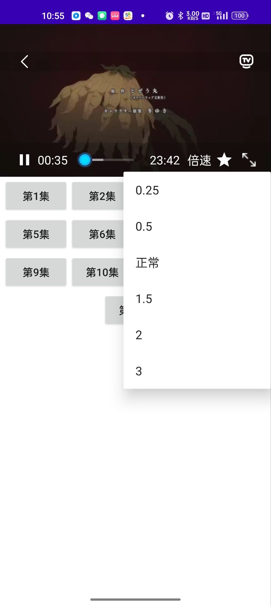

手机app默认使用远程树莓派服务器地址， 如需本地调试， 修改文件Graduation_kotlin\app\src\main\java\com\example\graduation\GraduationApplication.kt, host1对应linkdatabase_java服务， host2对应myapp_python服务。

代码中的myapp_python使用了phantomjs，需要去官网下载并修改文件名为nodejs， 并配置环境变量

需要node.js环境

